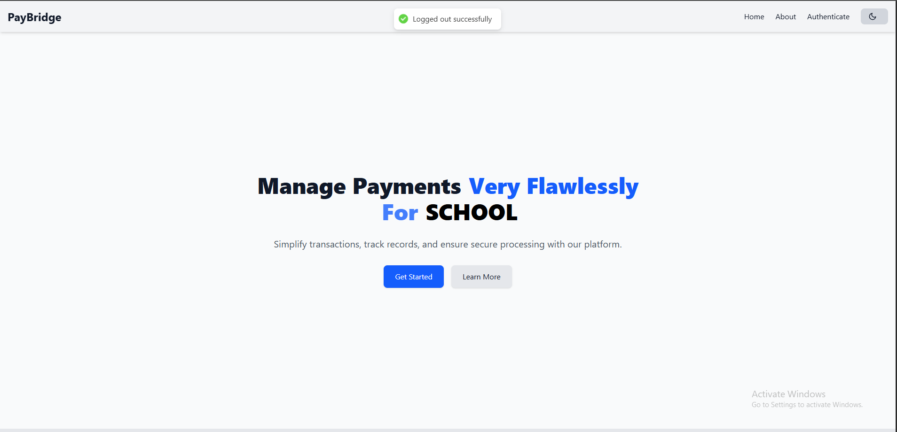
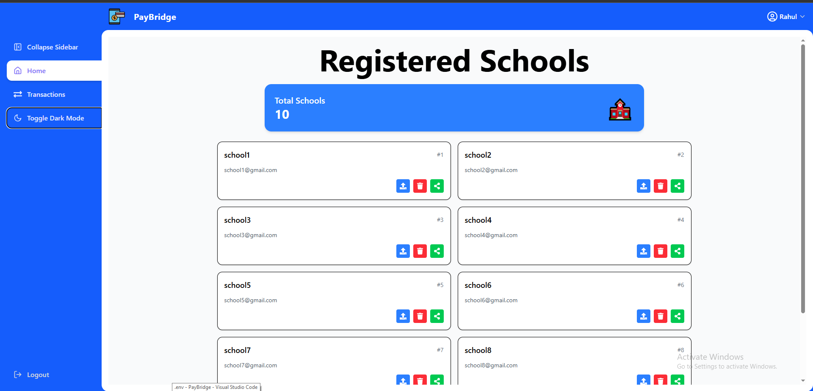
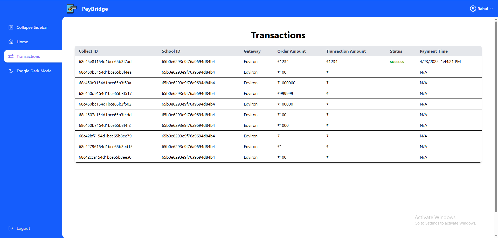
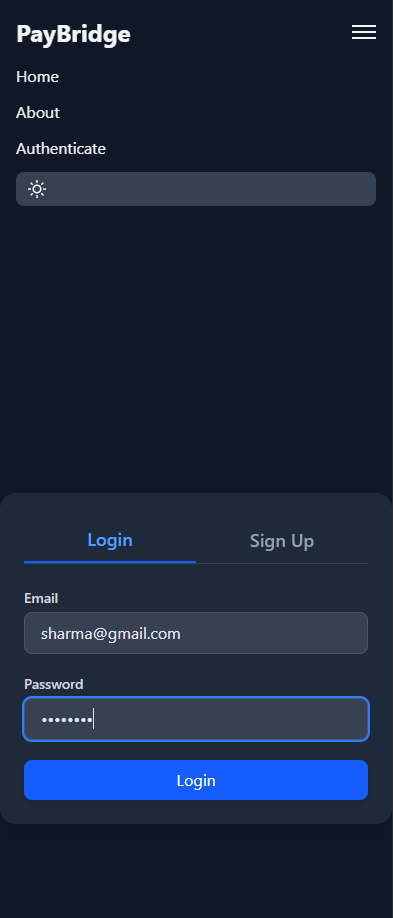
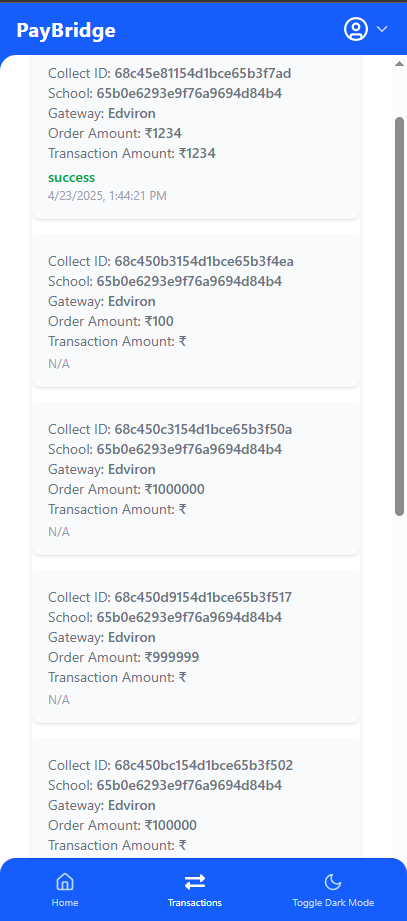
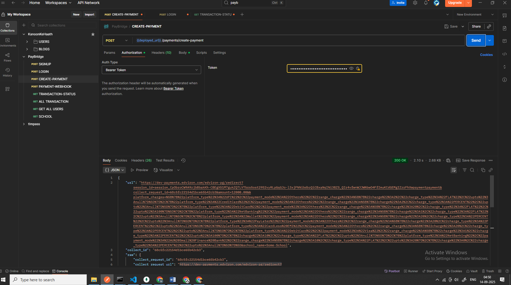
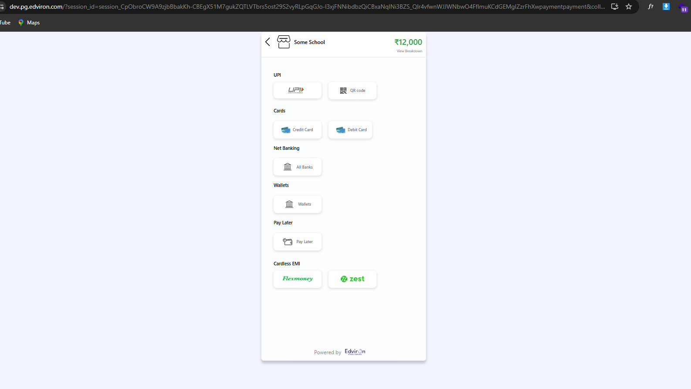
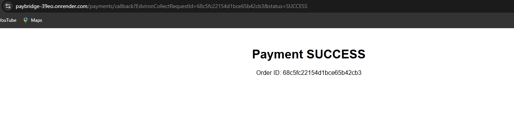
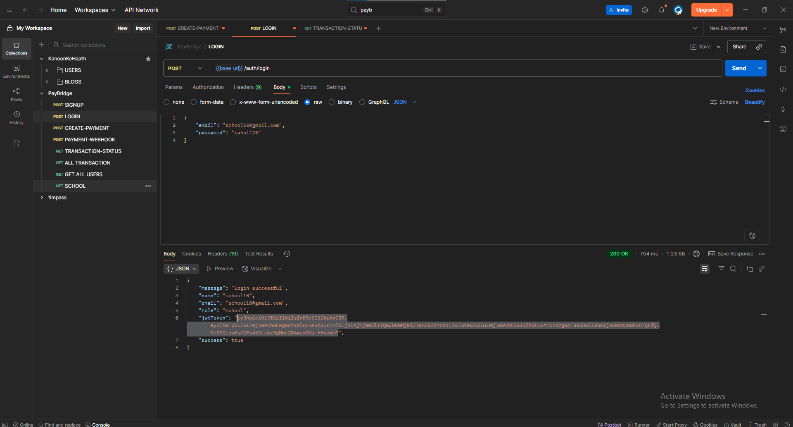

# 🚀 Edviron Payments Microservice

**Live Demo:** [edvironpay.vercel.app](https://edvironpay.vercel.app)lvie

## 🔐 Auth APIs (`/auth`)

- **POST** `/auth/signup` → User signup (with validation, creates account).
- **POST** `/auth/login` → User login (returns JWT).

## 💳 Payment APIs (`/payments`)

- **POST** `/payments/create-payment` → Create a new payment order (**protected**).
- **POST** `/payments/webhook` → Receive webhook events from gateway (**public**).
- **GET** `/payments/callback` → Callback URL for browser redirection after payment (**public**).
- **GET** `/payments/transaction-status/:collect_id` → Get transaction status from Edviron API (**protected**).

## 📊 Transaction APIs (`/transactions`)

- **GET** `/transactions`  
  → List transactions with filters (page, limit, sort, order, status, school_id, date range).
- **GET** `/transactions/school/:schoolId`  
  → Get all transactions for a specific school.

## 🚗 Product APIs (`/products`)

- **GET** `/products/` → Get product list (dummy data, **protected**).

## 🩺 Health Check

- **GET** `/` → Service health endpoint (`Edviron payments microservice running 🚀`).

---

✅ Total: **9 APIs + 1 Health Check = 10 Endpoints**
ALL THE BACKEND API'S ARE READY USE POSTMAN TO TEST ALL THE APIS

---

# 🎨 Frontend Features

## 👨‍🎓 School Login

test credentials
email : school1@gmail.com
password: rahul123

- Schools can log in using their credentials.
- Limited access to only their transactions and related data.

## 👨‍💼 Admin Login

test credentials
email : admin@gmail.com
password: rahul123

- Admin users log in with elevated privileges.
- Access to full dashboard and management features.

## 📊 Admin Dashboard

- Displays overall system stats and quick insights.
- Central hub for navigation across pages.

## 🌓 Dark Mode Toggle

- Switch between light and dark themes.

## 📑 Sidebar Toggle

- Collapsible sidebar for easier navigation.

## 👥 User Listing Page

- Admin can view and manage all registered users.

## 💵 Transactions Page

- View, search, and filter transaction history.
- Supports pagination and sorting.

---

# 🖼 Screenshots

## 💻 PC Screenshots

- 
- 
- 

## 📱 Phone Screenshots

- 
- 

## 💵 Payment Screenshots

- 
- 
- 

## 📝 Postman Screenshots

- 

# ⚙ Environment Setup

## Backend Environment Variables

Create a `.env` file in the backend folder:

MONGO_DB_PASemail : admin@gmail.com

MONGO_DB_CONNECTION="<your-mongodb-connection-string>"
JWT_SECRET="<your-jwt-secret>"
PAYMENT_API_KEY="<your-payment-api-key>"
PG_SECRET="<your-pg-secret>"
SCHOOL_ID="<your-school-id>"

## Frontend Environment Variables

Create a `.env` file in the frontend folder:

VITE_API_URL="http://localhost:8080"

## Setup Commands

### Backend

cd backend
npm install
npm run start

### Frontend

cd frontend
npm install
npm run dev
